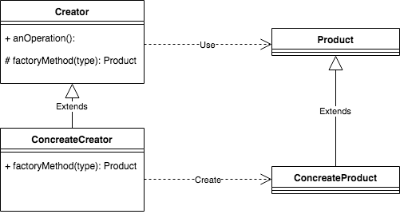

# FactoryMethod Pattern

## Introduction

FactoryMethod Patternはオブジェクトの生成についての関心ごとをサブクラスに移譲する事で、処理の再利用性を高める事を目的としたパターン。
SuperClassであるCreatorから生成についての実処理をSubClassであるConcreateCreatorに切り出す事で
生成以外の実装の再利用を実現する。

## Overview

* origin

## Conclusion

golangでは継承がないので、厳密な意味でFactoryMethodを再現する事はできない。
今回のサンプルでは、embedを利用する事で実装の再利用性についてを表現している。
